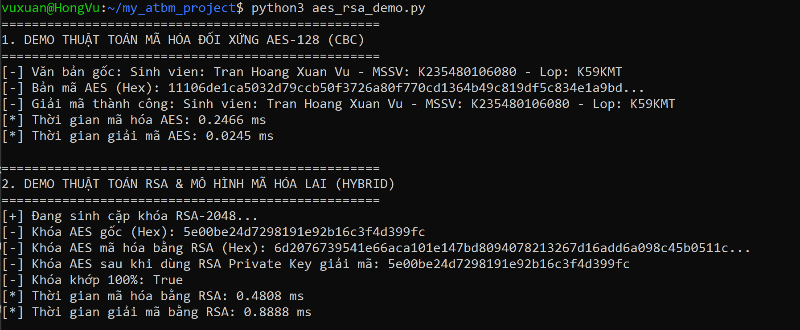

# BÀI TẬP VỀ NHÀ MÔN AN TOÀN VÀ BẢO MẬT THÔNG TIN - TNUT

## Thông tin sinh viên
* **Họ và tên**: Trần Hoàng Xuân Vũ
* **Mã sinh viên**: K235480106080
* **Lớp**: K59KMT - Kĩ thuật máy tính
* **Môn học**: An toàn và bảo mật thông tin
* **Deadline**: 23h59 ngày 28/09/2026
* **GitHub Repository**: https://github.com/k235480106080-glitch/BT_ATBM_TNUT

---

## MỤC 1. THUẬT TOÁN MÃ HÓA HIỆN ĐẠI DES VÀ AES

### 1.1. Thuật toán mã hóa DES (Data Encryption Standard)

#### a. Mô tả thuật toán
* **Loại mã hóa**: Mã hóa đối xứng khối (Symmetric Block Cipher) dựa trên cấu trúc Mạng Feistel (Feistel Network).
* **Kích thước khối dữ liệu**: 64 bits cho mỗi khối mã hóa.
* **Độ dài khóa**: Khóa đầu vào dài 64 bits, có 8 bits làm nhiệm vụ kiểm tra chẵn lẻ (parity check), độ dài khóa thực tế dùng để mã hóa là **56 bits**.

#### b. Quy trình mã hóa (Encryption Process)
1. **Hoán vị ban đầu (Initial Permutation - IP)**: Sắp xếp lại thứ tự 64 bits đầu vào theo bảng hoán vị cố định.
2. **16 Vòng Feistel (16 Rounds)**:
   * Chia 64 bits thành 2 nửa 32 bits: Nửa trái L_0 và Nửa phải R_0.
   * Tại mỗi vòng i (từ i = 1 đến 16), biến đổi theo công thức:
     * **L_i = R_{i-1}**
     * **R_i = L_{i-1} ⊕ f(R_{i-1}, K_i)**
   * **Hàm f(R_{i-1}, K_i)** bao gồm: Expansion (E-box) -> XOR Key K_i -> S-Boxes Substitution -> Permutation (P-box).
3. **Đảo ngược 2 nửa & Hoán vị cuối (Final Permutation - IP^-1)**: Ghép R_16 L_16 và thực hiện hoán vị IP^-1 thu được bản mã 64 bits.

#### c. Quy trình giải mã (Decryption Process)
* Quy trình giải mã hoàn toàn giống hệt quy trình mã hóa.
* Khóa vòng K_i được đưa vào theo thứ tự ngược lại: K_16, K_15, ..., K_1.

---

### 1.2. Thuật toán mã hóa AES (Advanced Encryption Standard)

#### a. Mô tả thuật toán
* **Loại mã hóa**: Mã hóa đối xứng khối dựa trên cấu trúc Mạng thế - hoán vị (Substitution-Permutation Network - SPN).
* **Kích thước khối dữ liệu**: Cố định **128 bits** (ma trận trạng thái State 4x4 bytes).
* **Độ dài khóa & Số vòng lặp**:
  * AES-128: Khóa **128 bits** (16 bytes) -> **10 vòng mã hóa**.
  * AES-192: Khóa **192 bits** (24 bytes) -> **12 vòng mã hóa**.
  * AES-256: Khóa **256 bits** (32 bytes) -> **14 vòng mã hóa**.

#### b. Quy trình mã hóa AES-128 (10 vòng)
1. **Mở rộng khóa (Key Expansion)**: Tạo 11 khóa vòng từ khóa chính 128 bits.
2. **Vòng khởi tạo (Initial Round)**: AddRoundKey (XOR State với K_0).
3. **9 Vòng chuẩn (Rounds 1 đến 9)**: SubBytes -> ShiftRows -> MixColumns -> AddRoundKey.
4. **Vòng cuối (Final Round - Vòng 10)**: Bỏ qua MixColumns (chỉ gồm SubBytes -> ShiftRows -> AddRoundKey).

#### c. Quy trình giải mã AES
* Thực hiện các phép toán nghịch đảo theo thứ tự ngược lại: **AddRoundKey** -> **InvShiftRows** -> **InvSubBytes** -> **InvMixColumns**.

---

### 1.3. Cài đặt thuật toán AES bằng Python & Kết quả thực thi

Mã nguồn thực thi nằm tại file `aes_rsa_demo.py`.

#### Ảnh minh chứng kết quả chạy chương trình thực tế:

---

## MỤC 2. THUẬT TOÁN MÃ HÓA BẤT ĐỐI XỨNG RSA

### 2.1. Giới thiệu thuật toán RSA
RSA (Rivest–Shamir–Adleman) dựa trên tính chất toán học: **Phép nhân hai số nguyên tố lớn thì rất dễ, nhưng phân tích tích của chúng ra thừa số nguyên tố thì vô cùng khó**.

### 2.2. Quy trình sinh cặp khóa Bí mật (Private Key) và Công khai (Public Key)

1. **Chọn hai số nguyên tố lớn**: Chọn ngẫu nhiên **p** và **q** (p khác q).
2. **Tính Modulo n**: **n = p × q** (Độ dài bit của n chính là độ dài khóa RSA).
3. **Tính hàm số Euler ϕ(n)**: **ϕ(n) = (p - 1) × (q - 1)**
4. **Chọn Số mũ công khai e**: Chọn e sao cho **1 < e < ϕ(n)** và **gcd(e, ϕ(n)) = 1** (thường chọn e = 65537).
5. **Tính Số mũ bí mật d**: Tìm d sao cho **(d × e) ≡ 1 (mod ϕ(n))**.

**KẾT QUẢ BỘ KHÓA THU ĐƯỢC**:
* **Khóa công khai (Public Key)**: PU = {e, n} (Công bố công khai).
* **Khóa bí mật (Private Key)**: PR = {d, n} (Lưu trữ tuyệt mật).

---

## MỤC 3. CÁC MÔ HÌNH ÁP DỤNG RSA VÀ KẾT HỢP SỨC MẠNH RSA & AES

### 3.1. Các mô hình áp dụng thuật toán RSA

#### Mô hình 1: Bảo mật / Xác thực người nhận (Receiver Authentication)
* **Bên gửi (A)**: Dùng **Public Key của B (PU_B)** để mã hóa: **C = M^e_B mod n_B**
* **Bên nhận (B)**: Dùng **Private Key của B (PR_B)** để giải mã: **M = C^d_B mod n_B**
* **Ý nghĩa**: Đạt được tính **Bảo mật (Confidentiality)**.

#### Mô hình 2: Xác thực người gửi / Chữ ký số (Sender Authentication)
* **Bên gửi (A)**: Dùng **Private Key của A (PR_A)** để mã hóa/ký: **S = M^d_A mod n_A**
* **Bên nhận (B)**: Dùng **Public Key của A (PU_A)** để giải mã/xác minh: **M = S^e_A mod n_A**
* **Ý nghĩa**: Đạt được tính **Xác thực người gửi** và **Chống chối bỏ**.

#### Mô hình 3: Kết hợp cả Xác thực người gửi và Xác thực người nhận
* **Bên gửi (A)**: Ký bằng PR_A trước, sau đó mã hóa tiếp bằng PU_B.
* **Bên nhận (B)**: Giải mã bằng PR_B trước, sau đó xác minh chữ ký bằng PU_A.
* **Ý nghĩa**: Đạt được đồng thời cả **Tính bảo mật** lẫn **Tính xác thực nguồn gốc**.

---

### 3.2. So sánh thời gian mã hóa / giải mã của RSA và AES

| Tiêu chí so sánh | Thuật toán đối xứng AES | Thuật toán bất đối xứng RSA |
| :--- | :--- | :--- |
| **Bản chất toán học** | Phép thế S-Box, dịch hàng, nhân ma trận Galois GF(2^8). | Phép lũy thừa modulo trên các số nguyên rất lớn (2048 - 4096 bits). |
| **Tốc độ mã hóa / giải mã** | **Cực kỳ nhanh** (vài microsecond). Hỗ trợ phần cứng CPU AES-NI. | **Rất chậm** (chậm hơn AES từ **1.000 đến 10.000 lần**). |
| **Kích thước dữ liệu** | Không giới hạn (mã hóa tập tin gigabyte mượt mà). | Bị giới hạn (dữ liệu mã hóa phải nhỏ hơn độ dài khóa RSA). |
| **Quản lý khóa** | Khó phân phối khóa bí mật an toàn trên kênh truyền mở. | Dễ dàng chia sẻ Public Key công khai. |

---

### 3.3. Mô hình kết hợp sức mạnh của RSA và AES (Mã hóa lai - Hybrid Cryptosystem)

Trong thực tế (như HTTPS/TLS, PGP, SSH), mô hình **Mã hóa lai (Hybrid Encryption)** được áp dụng:

1. **Mã hóa dữ liệu (Tốc độ AES)**: Bên gửi tạo một **Khóa phiên AES (Session Key)** ngẫu nhiên dùng 1 lần, dùng khóa này mã hóa toàn bộ dữ liệu lớn với tốc độ cực nhanh.
2. **Mã hóa khóa (An toàn RSA)**: Bên gửi lấy **Public Key RSA của bên nhận** để mã hóa chuỗi Khóa phiên AES.
3. **Truyền dữ liệu**: Bên gửi đóng gói và gửi 2 thành phần: `[Bản mã Dữ liệu bằng AES]` + `[Bản mã Khóa AES bằng RSA]`.
4. **Giải mã tại bên nhận**: Bên nhận dùng **Private Key RSA của mình** để giải mã ra Khóa phiên AES, sau đó giải mã dữ liệu ban đầu.

---
